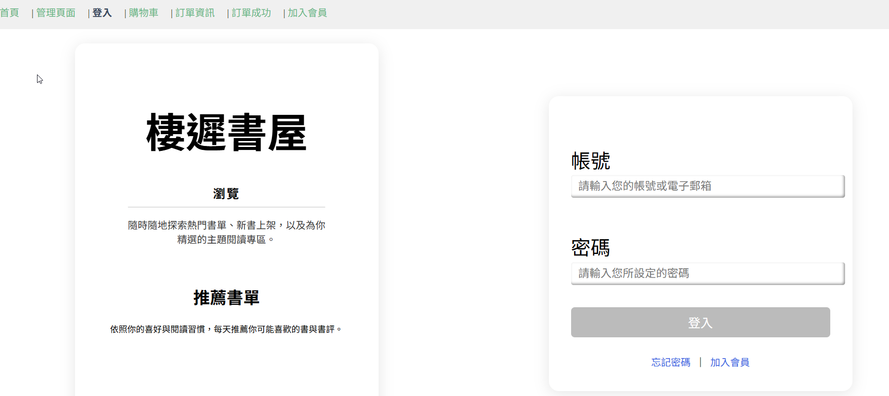

# my-auth-project

## Project setup
```
npm install
```


1. Carate new project
2. Download all files to your project folders
3. Run under your folder : npm run serve
4. Into localhost : http://localhost:8080/


