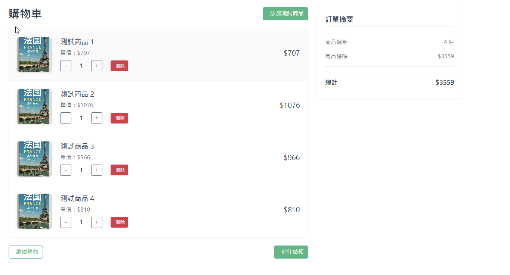
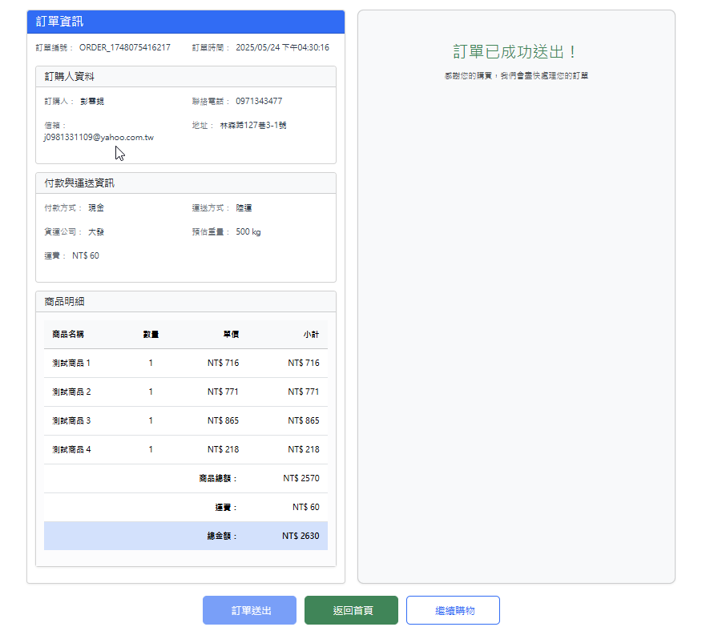
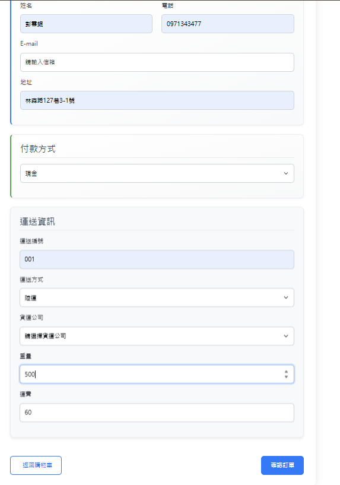
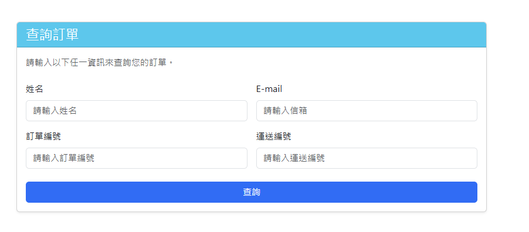

# my-auth-project

## Project setup
```
npm install
```
5/24 更新項目
1. 購物車頁面編排
2. 訂單資訊新增運送資訊
3. 重新編排訂單資訊
4. 新增查詢訂單頁面
5. 更新購物車與訂單邏輯，使訂單正常化

使用方式. 
1. Carate new project
2. Download all files to your project folders
3. Run under your folder : npm run serve
4. Into localhost : http://localhost:8080/





